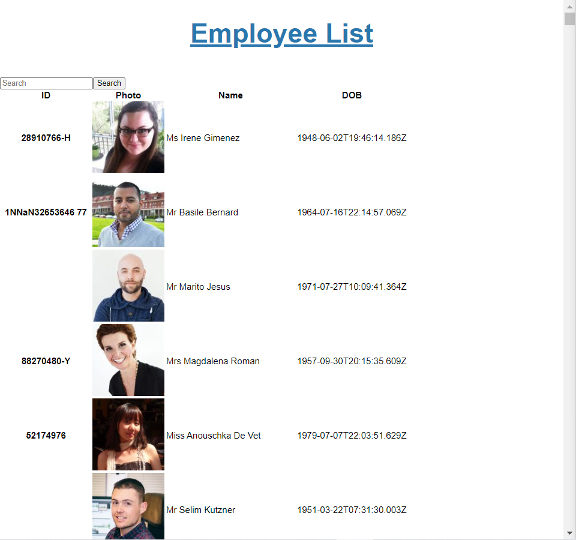
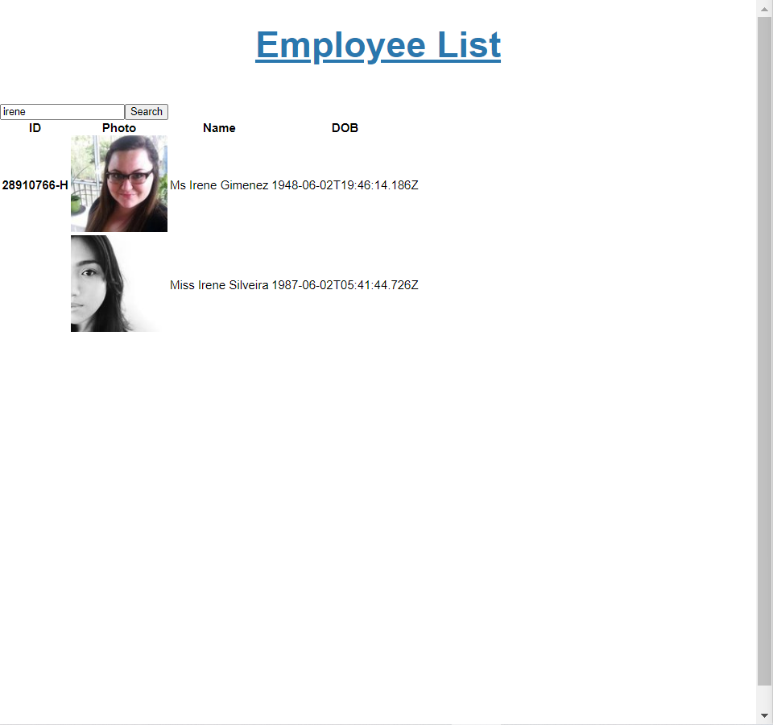

# Employee directory

## Table of Content
* [Project Links](#Project-Links)
* [Screenshots-Demo](#Screenshots)
* [Project Objective ](#Project-Objective)
* [Installation](#Installation)
* [Technologies](#Technologies)
* [Contact](#Contact)
* [License](#License)
## Project Links
* [Github Repo](https://github.com/zoeshelly-tan/employee_directory)
* [Heroku link](https://cryptic-gorge-87999.herokuapp.com/)

## Project Objective
The project is design for employee or manager would benefit greatly from being able to view non-sensitive data about other employees. It would be particularly helpful to be able to filter employees by name.

## Installation
- Node.js 
- npm install
- react

## Technologies
-      Node.js
-      Javascript
-      Heroku
-      react
-      Json
-      API
## Display 

## Author Contact
Contact the author with any questions! 
Github link: [Shelly](https://github.com/zoeshelly-tan)
## License
This project is [MIT](https://choosealicense.com/licenses/MIT/) licensed.
